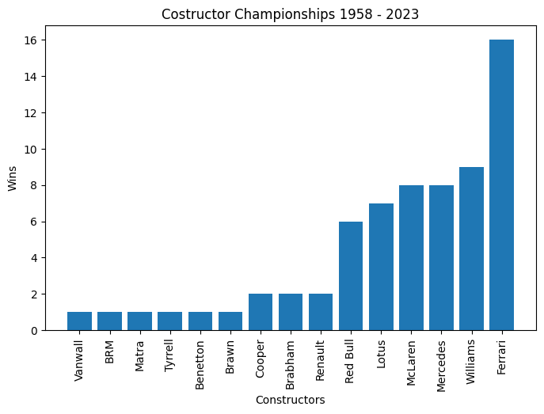

# Webscraping + cleaning

Used: https://en.wikipedia.org/wiki/List_of_Formula_One_World_Constructors%27_Champions


```python
import requests
from bs4 import BeautifulSoup as bs
import matplotlib.pyplot as plt
import pandas as pd
import numpy as np


# Make a request
page = requests.get(
    "https://en.wikipedia.org/wiki/List_of_Formula_One_World_Constructors%27_Champions")
soup = bs(page.content, 'html.parser')

# Find 'World Constructors' Champions by season' table
tables = soup.find_all("table")
constructors_wiki_table = tables[2]

# Find all <tr> in the table
list_of_tr = constructors_wiki_table.find_all("tr")

# Find all <td> (columns) 
arr_rows = []
for tr in list_of_tr:
    td = tr.find_all("td")
    
    if len(td) > 0:
        temp_arr = []

        for val in td:
            val = val.get_text()
            val = val.translate(str.maketrans('','',"†\n*")) #sign deleting
            temp_arr.append(val)
            
        arr_rows.append(temp_arr)


# All rows from column in array of arrays
print("[Season, Chassis, Engine, Tyre, Drivers, Poles, Wins, Podiums, Fastest laps, Points, % Points, Clinched, Margin points, Margin %] \n")
for i in arr_rows:
    print(i)
```

    [Season, Chassis, Engine, Tyre, Drivers, Poles, Wins, Podiums, Fastest laps, Points, % Points, Clinched, Margin points, Margin %] 
    
    ['1958', 'Vanwall', 'Vanwall', 'D', 'Stirling MossTony Brooks', '5', '6', '9', '3', '48', '100.00 (71.25)', 'Race 10 of 11', '8', '16.66']
    ['1959', 'Cooper', 'Climax', 'D', 'Jack BrabhamStirling MossBruce McLaren', '5', '5', '13', '5', '40', '100.00 (82.81)', 'Race 8 of 9', '8', '20.00']
    ['1960', 'Cooper', 'Climax', 'D', 'Jack BrabhamBruce McLaren', '4', '6', '14', '5', '48', '100.00 (80.56)', 'Race 7 of 10', '14', '29.17']
    ['1961', 'Ferrari', 'Ferrari', 'D', 'Phil HillWolfgang von Trips', '6', '5', '14', '5', '45', '100.00 (81.25)', 'Race 5 of 8', '10', '22.22']
    ['1962', 'BRM', 'BRM', 'D', 'Graham Hill', '1', '4', '8', '3', '42', '93.33 (69.14)', 'Race 9 of 9', '6', '14.29']
    ['1963', 'Lotus', 'Climax', 'D', 'Jim Clark', '7', '7', '9', '6', '54', '100.00 (82.22)', 'Race 7 of 10', '18', '33.33']
    ['1964', 'Ferrari', 'Ferrari', 'D', 'John SurteesLorenzo Bandini', '2', '3', '10', '2', '45', '83.33 (54.44)', 'Race 10 of 10', '3', '6.67']
    ['1965', 'Lotus', 'Climax', 'D', 'Jim Clark', '6', '6', '7', '6', '54', '100.00 (64.44)', 'Race 7 of 10', '9', '16.67']
    ['1966', 'Brabham', 'Repco', 'G', 'Jack Brabham', '3', '4', '9', '2', '42', '93.33 (60.49)', 'Race 8 of 9', '11', '26.19']
    ['1967', 'Brabham', 'Repco', 'G', 'Denny HulmeJack Brabham', '2', '4', '14', '2', '63', '77.78 (67.68)', 'Race 8 of 11', '19', '30.16']
    ['1968', 'Lotus', 'Ford', 'F', 'Graham HillJo SiffertJim ClarkJackie Oliver', '5', '5', '9', '5', '62', '68.89 (57.41)', 'Race 12 of 12', '13', '20.97']
    ['1969', 'Matra', 'Ford', 'D', 'Jackie StewartJean-Pierre Beltoise', '2', '6', '10', '6', '66', '81.48 (66.67)', 'Race 8 of 11', '17', '25.72']
    ['1970', 'Lotus', 'Ford', 'F', 'Jochen RindtEmerson FittipaldiGraham HillJohn Miles', '3', '6', '7', '1', '59', '59.60 (50.43)', 'Race 12 of 13', '7', '11.86']
    ['1971', 'Tyrrell', 'Ford', 'G', 'Jackie StewartFrançois Cevert', '6', '7', '11', '4', '73', '90.12 (73.74)', 'Race 9 of 11', '37', '50.68']
    ['1972', 'Lotus', 'Ford', 'F', 'Emerson Fittipaldi', '3', '5', '8', '4', '61', '67.78 (56.48)', 'Race 10 of 12', '10', '19.39']
    ['1973', 'Lotus', 'Ford', 'G', '1. Emerson Fittipaldi2. Ronnie Peterson', '10', '7', '15', '7', '92', '78.63 (71.11)', 'Race 15 of 15', '10', '10.87']
    ['1974', 'McLaren', 'Ford', 'G', '5. Emerson Fittipaldi6. Denny Hulme33. Mike Hailwood(33). David Hobbs(33). Jochen Mass', '2', '4', '10', '1', '73', '62.39 (55.56)', 'Race 15 of 15', '8', '10.96']
    ['1975', 'Ferrari', 'Ferrari', 'G', '11. Clay Regazzoni12. Niki Lauda', '9', '6', '11', '6', '72.5', '67.13 (61.97)', 'Race 13 of 14', '18.5', '25.52']
    ['1976', 'Ferrari', 'Ferrari', 'G', '1. Niki Lauda2. Clay Regazzoni', '4', '6', '13', '7', '83', '65.87 (57.64)', 'Race 15 of 16', '9', '10.84']
    ['1977', 'Ferrari', 'Ferrari', 'G', '11. Niki Lauda12. Carlos Reutemann', '2', '4', '16', '3', '95', '70.37 (63.40)', 'Race 14 of 17', '33', '34.73']
    ['1978', 'Lotus', 'Ford', 'G', '5. Mario Andretti6. Ronnie Peterson', '12', '8', '14', '7', '86', '68.25 (59.72)', 'Race 13 of 16', '28', '32.56']
    ['1979', 'Ferrari', 'Ferrari', 'M', '11. Jody Scheckter12. Gilles Villeneuve', '2', '6', '13', '6', '113', '50.22', 'Race 13 of 15', '38', '33.63']
    ['1980', 'Williams', 'Ford', 'G', '27. Alan Jones28. Carlos Reutemann', '3', '6', '18', '5', '120', '57.14', 'Race 12 of 14', '54', '45.00']
    ['1981', 'Williams', 'Ford', 'G', '1. Alan Jones2. Carlos Reutemann', '2', '4', '13', '7', '95', '42.22', 'Race 14 of 15', '34', '35.79']
    ['1982', 'Ferrari', 'Ferrari', 'G', '27. Gilles Villeneuve28. Didier Pironi(27). Patrick Tambay(28). Mario Andretti', '3', '3', '11', '2', '74', '30.83', 'Race 16 of 16', '5', '6.75']
    ['1983', 'Ferrari', 'Ferrari', 'G', '27. Patrick Tambay28. René Arnoux', '8', '4', '12', '3', '89', '39.56', 'Race 15 of 15', '10', '11.24']
    ['1984', 'McLaren', 'TAG', 'M', '7. Alain Prost8. Niki Lauda', '3', '12', '18', '8', '143.5', '61.72', 'Race 13 of 16', '86', '59.93']
    ['1985', 'McLaren', 'TAG', 'G', '1. Niki Lauda2. Alain Prost(1). John Watson', '2', '6', '12', '6', '90', '37.50', 'Race 16 of 16', '8', '8.89']
    ['1986', 'Williams', 'Honda', 'G', '5. Nigel Mansell6. Nelson Piquet', '4', '9', '19', '11', '141', '58.75', 'Race 14 of 16', '45', '31.91']
    ['1987', 'Williams', 'Honda', 'G', '5. Nigel Mansell6. Nelson Piquet(5). Riccardo Patrese', '12', '9', '18', '7', '137', '57.08', 'Race 13 of 16', '61', '44.53']
    ['1988', 'McLaren', 'Honda', 'G', '11. Alain Prost12. Ayrton Senna', '15', '15', '25', '10', '199', '82.92', 'Race 11 of 16', '134', '67.34']
    ['1989', 'McLaren', 'Honda', 'G', '1. Ayrton Senna2. Alain Prost', '15', '10', '18', '8', '141', '58.75', 'Race 12 of 16', '64', '45.39']
    ['1990', 'McLaren', 'Honda', 'G', '27. Ayrton Senna28. Gerhard Berger', '12', '6', '18', '5', '121', '50.42', 'Race 15 of 16', '11', '9.10']
    ['1991', 'McLaren', 'Honda', 'G', '1. Ayrton Senna2. Gerhard Berger', '10', '8', '18', '4', '139', '56.05', 'Race 16 of 16', '14', '10.07']
    ['1992', 'Williams', 'Renault', 'G', '5. Nigel Mansell6. Riccardo Patrese', '15', '10', '21', '11', '164', '64.06', 'Race 12 of 16', '65', '39.63']
    ['1993', 'Williams', 'Renault', 'G', '0. Damon Hill2. Alain Prost', '15', '10', '22', '10', '168', '65.63', 'Race 12 of 16', '84', '50.00']
    ['1994', 'Williams', 'Renault', 'G', '0. Damon Hill2. Ayrton Senna(2). David Coulthard(2). Nigel Mansell', '6', '7', '13', '8', '118', '46.09', 'Race 16 of 16', '15', '12.71']
    ['1995', 'Benetton', 'Renault', 'G', '1. Michael Schumacher2. Johnny Herbert', '4', '11', '15', '8', '137', '50.37', 'Race 16 of 17', '25', '18.25']
    ['1996', 'Williams', 'Renault', 'G', '5. Damon Hill6. Jacques Villeneuve', '12', '12', '21', '11', '175', '68.36', 'Race 12 of 16', '105', '60.00']
    ['1997', 'Williams', 'Renault', 'G', '3. Jacques Villeneuve4. Heinz-Harald Frentzen', '11', '8', '15', '9', '123', '45.22', 'Race 16 of 17', '21', '17.07']
    ['1998', 'McLaren', 'Mercedes', 'B', '7. David Coulthard8. Mika Häkkinen', '12', '9', '20', '9', '156', '60.94', 'Race 16 of 16', '23', '14.74']
    ['1999', 'Ferrari', 'Ferrari', 'B', '3. Michael Schumacher4. Eddie Irvine(3). Mika Salo', '3', '6', '17', '6', '128', '50.00', 'Race 16 of 16', '4', '3.13']
    ['2000', 'Ferrari', 'Ferrari', 'B', '3. Michael Schumacher4. Rubens Barrichello', '10', '10', '21', '5', '170', '62.50', 'Race 17 of 17', '18', '10.59']
    ['2001', 'Ferrari', 'Ferrari', 'B', '1. Michael Schumacher2. Rubens Barrichello', '11', '9', '24', '3', '179', '65.81', 'Race 13 of 17', '77', '43.02']
    ['2002', 'Ferrari', 'Ferrari', 'B', '1. Michael Schumacher2. Rubens Barrichello', '10', '15', '27', '12', '221', '81.25', 'Race 13 of 17', '129', '58.37']
    ['2003', 'Ferrari', 'Ferrari', 'B', '1. Michael Schumacher2. Rubens Barrichello', '8', '8', '16', '8', '158', '54.86', 'Race 16 of 16', '14', '8.86']
    ['2004', 'Ferrari', 'Ferrari', 'B', '1. Michael Schumacher2. Rubens Barrichello', '12', '15', '29', '14', '262', '80.86', 'Race 13 of 18', '143', '54.58']
    ['2005', 'Renault', 'Renault', 'M', '5. Fernando Alonso6. Giancarlo Fisichella', '7', '8', '18', '3', '191', '55.85', 'Race 19 of 19', '9', '4.71']
    ['2006', 'Renault', 'Renault', 'M', '1. Fernando Alonso2. Giancarlo Fisichella', '7', '8', '19', '5', '206', '63.58', 'Race 18 of 18', '5', '2.43']
    ['2007', 'Ferrari', 'Ferrari', 'B', '5. Felipe Massa6. Kimi Räikkönen', '11', '9', '22', '11', '204', '66.67', 'Race 14 of 17', '103', '50.49']
    ['2008', 'Ferrari', 'Ferrari', 'B', '1. Kimi Räikkönen2. Felipe Massa', '8', '8', '19', '13', '172', '53.09', 'Race 18 of 18', '21', '12.21']
    ['2009', 'Brawn', 'Mercedes', 'B', '22. Jenson Button23. Rubens Barrichello', '5', '8', '15', '4', '172', '57.91', 'Race 16 of 17', '18.5', '10.76']
    ['2010', 'Red Bull', 'Renault', 'B', '5. Sebastian Vettel6. Mark Webber', '15', '9', '20', '6', '498[c]', '60.95', 'Race 18 of 19', '44', '8.84']
    ['2011', 'Red Bull', 'Renault', 'P', '1. Sebastian Vettel2. Mark Webber', '18', '12', '28', '10', '650', '79.56', 'Race 16 of 19', '153', '23.54']
    ['2012', 'Red Bull', 'Renault', 'P', '1. Sebastian Vettel2. Mark Webber', '8', '7', '14', '7', '460', '53.49', 'Race 19 of 20', '60', '13.04']
    ['2013', 'Red Bull', 'Renault', 'P', '1. Sebastian Vettel2. Mark Webber', '11', '13', '24', '12', '596', '72.95', 'Race 16 of 19', '236', '39.60']
    ['2014', 'Mercedes', 'Mercedes', 'P', '6. Nico Rosberg44. Lewis Hamilton', '18', '16', '31', '11', '701', '81.51', 'Race 16 of 19', '296', '42.23']
    ['2015', 'Mercedes', 'Mercedes', 'P', '6. Nico Rosberg44. Lewis Hamilton', '18', '16', '32', '13', '703', '86.05', 'Race 15 of 19', '275', '39.12']
    ['2016', 'Mercedes', 'Mercedes', 'P', '6. Nico Rosberg44. Lewis Hamilton', '20', '19', '33', '9', '765', '84.72', 'Race 17 of 21', '297', '38.82']
    ['2017', 'Mercedes', 'Mercedes', 'P', '44. Lewis Hamilton77. Valtteri Bottas', '15', '12', '26', '9', '668', '77.67', 'Race 17 of 20', '146', '21.86']
    ['2018', 'Mercedes', 'Mercedes', 'P', '44. Lewis Hamilton77. Valtteri Bottas', '13', '11', '25', '10', '655', '72.54', 'Race 20 of 21', '84', '12.82']
    ['2019', 'Mercedes', 'Mercedes', 'P', '44. Lewis Hamilton77. Valtteri Bottas', '10', '15', '32', '9', '739', '79.98', 'Race 17 of 21', '235', '31.80']
    ['2020', 'Mercedes', 'Mercedes', 'P', '44. Lewis Hamilton77. Valtteri Bottas(63). George Russell', '15', '13', '25', '9', '573', '76.60', 'Race 13 of 17', '254', '44.33']
    ['2021', 'Mercedes', 'Mercedes', 'P', '44. Lewis Hamilton77. Valtteri Bottas', '9', '9', '28', '10', '613.5', '63.84', 'Race 22 of 22', '28', '4.56']
    ['2022', 'Red Bull', 'RBPT', 'P', '1. Max Verstappen11. Sergio Pérez', '7', '17', '28', '8', '759', '74.93', 'Race 19 of 22', '205', '27.01']
    ['2023', 'Red Bull', 'Honda RBPT', 'P', '1. Max Verstappen11. Sergio Pérez', '14', '21', '30', '11', '860', '81.29', 'Race 16 of 22', '451', '52.44']
    

## Example use -> count constructor championships

### Preparing values needed


```python
# Dictionary
dict_contructors = {}

# Loop through arr of vals
for i in arr_rows:
    if i[1] not in dict_contructors.keys():
        dict_contructors[i[1]] = 1
    else:
        dict_contructors[i[1]] += 1

dict_contructors = dict(sorted(dict_contructors.items(), key=lambda item: item[1]))
print(dict_contructors)
```

    {'Vanwall': 1, 'BRM': 1, 'Matra': 1, 'Tyrrell': 1, 'Benetton': 1, 'Brawn': 1, 'Cooper': 2, 'Brabham': 2, 'Renault': 2, 'Red Bull': 6, 'Lotus': 7, 'McLaren': 8, 'Mercedes': 8, 'Williams': 9, 'Ferrari': 16}
    

### Forming chart


```python
fig,ax=plt.subplots(figsize=(8,5))
ax.bar(dict_contructors.keys(), dict_contructors.values())
ax.set_xlabel("Constructors")
plt.xticks(rotation=90)
ax.set_ylabel("Wins")
ax.set_title("Costructor Championships 1958 - 2023")
```


    Text(0.5, 1.0, 'Costructor Championships 1958 - 2023')


    

    

